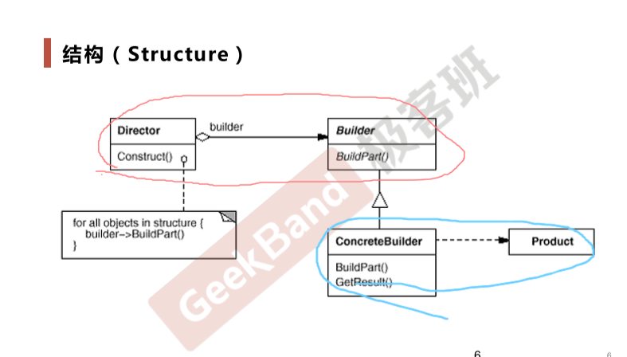
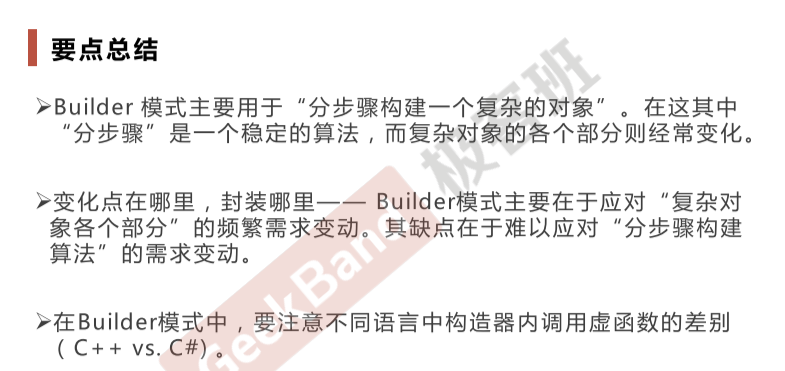

# Bulider构建器模式

#### 对象创建模式

#### 动机

&ensp;&ensp;&ensp;&ensp;在软件系统中，有时候面临着 一个复杂对象 的创建工作，其通常由各个部分的子对象用一定的算法构成；由于需求的变化，这个复杂对象的各个部分经常面临着剧烈的变化，但是将它们组合在一起的算法却相对稳定

#### 定义

&ensp;&ensp;&ensp;&ensp;将一个复杂对象的构建与其表示相分离，使得 同样的构建过程（稳定）可以创建不同的表示（变化）

