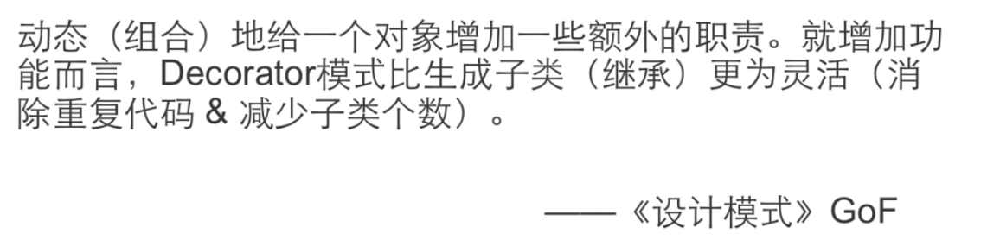

# Decorator

### “单一职责”模式

#### 动机

&ensp;&ensp;&ensp;&ensp;在某些情况下我们可能会“过度地使用继承来扩展对象地功能”，由于继承为类型引入的静态特质，使得这种扩展方法缺乏灵活性；并且随着子类的增多（扩展功能的增多），各种子类的组合会导致子类的膨胀

&ensp;&ensp;&ensp;&ensp;#### 继承体系如图（子类膨胀）

#### 装饰器模式，扩展功能使用组合而不是继承实现

&ensp;&ensp;&ensp;&ensp;> 通过采用组合而非继承的手法，Decorator模式实现了在运行时动态扩展对象功能的能力，而且可以根据需要扩展多个功能。避免了使用继承带来的灵活性差和多子类衍生问题

&ensp;&ensp;&ensp;&ensp;> Decorator类在接口上表现为 is a Component的继承关系，即Decorator类继承了Component类所具有的接口，但在实现上又表现为has a Component的组合关系，即Decorator类又使用了另外一个Component类

&ensp;&ensp;&ensp;&ensp;> Decorator模式的目的并非解决 多子类衍生出的多继承 问题，Decorator模式应用的要点在于解决 主题类在多个方向上的扩展功能  —- 是为 装饰 的含义

-

