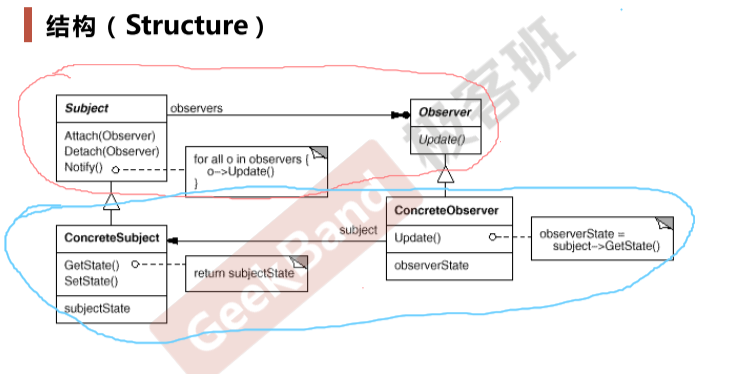

# Observer

[5_观察者模式.pdf](file/5_%E8%A7%82%E5%AF%9F%E8%80%85%E6%A8%A1%E5%BC%8F.pdf)

### 解决的问题

&ensp;&ensp;&ensp;&ensp;组件协作模式

&ensp;&ensp;&ensp;&ensp;框架和应用的协作

### 动机

&ensp;&ensp;&ensp;&ensp;通知依赖关系

> 定义对象间的一种一对多（变化）的依赖关系，以便当一个对象（Subject）的状态发生改变时，所有依赖它的对象都得到通知并自动更新

### 总结

&ensp;&ensp;&ensp;&ensp;使用面向对象的抽象，Observer模式使得我们可以独立地改变目标与观察者，从而使二者之间地依赖关系达致松耦合

&ensp;&ensp;&ensp;&ensp;目标发送通知时，无需指定观察者，通知（可以携带通知信息作为参数）会自动传播

&ensp;&ensp;&ensp;&ensp;观察者模式自己决定是否需要订阅通知，目标对象对此一无所知

&ensp;&ensp;&ensp;&ensp;Observer模式是基于事件的UI框架中非常常用的设计模式，也是MVC模式的一个重要组成部分

