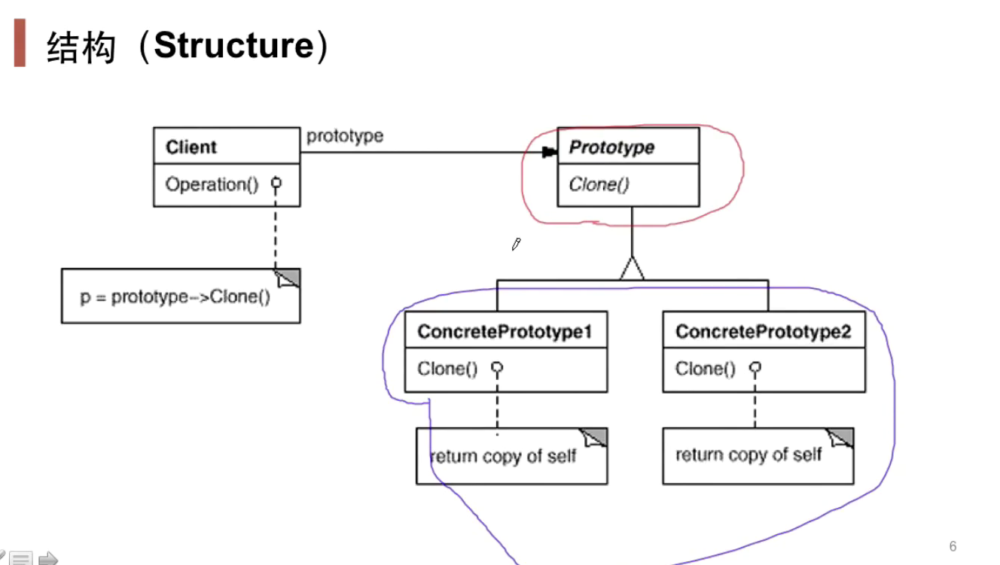
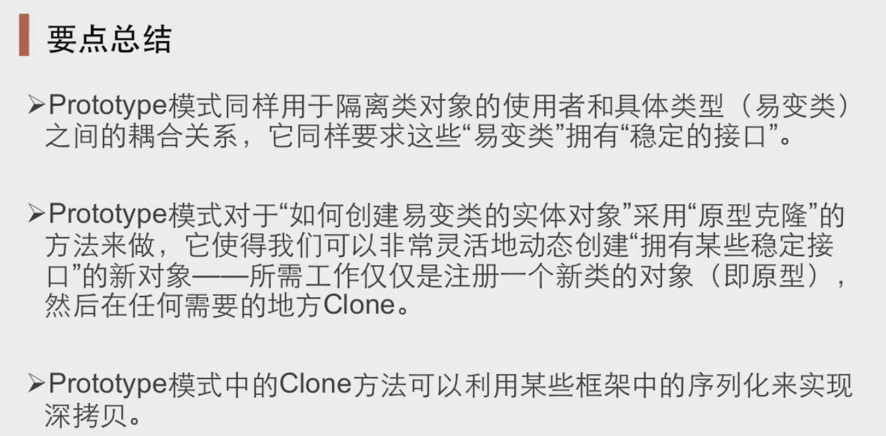

# Prototype原型模式

#### “对象创建模式”

#### 动机

&ensp;&ensp;&ensp;&ensp;在软件系统中，经常面临着 某些结构复杂的对象 的创建工作；由于需求的变化，这些对象经常面临着剧烈的变化，但是它们却具有比较稳定一致的接口

#### 定义

&ensp;&ensp;&ensp;&ensp;使用原型实例指定创建对象的种类，然后拷贝这些原型创建新的对象

