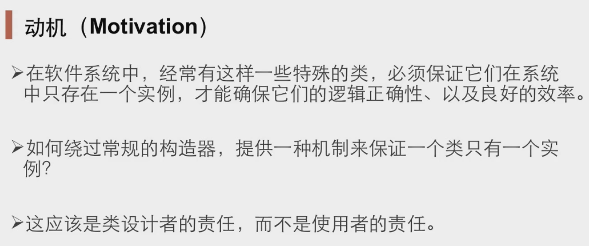
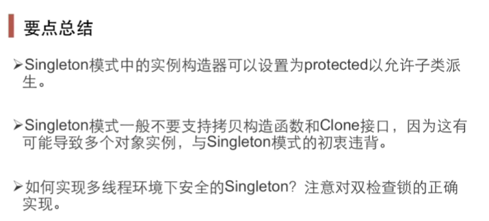

# Singleton单例模式

#### “对象性能”模式

&ensp;&ensp;&ensp;&ensp;面对对象很好的解决了抽象的问题，但是必不可免地要付出一定地代价。对于通常情况来讲，面向对象地成本大都可以忽略不记。但是在某些情况，面向对象所带来的成本必须谨慎处理

&ensp;&ensp;&ensp;&ensp;Singleton

&ensp;&ensp;&ensp;&ensp;Flyweight

#### 动机

