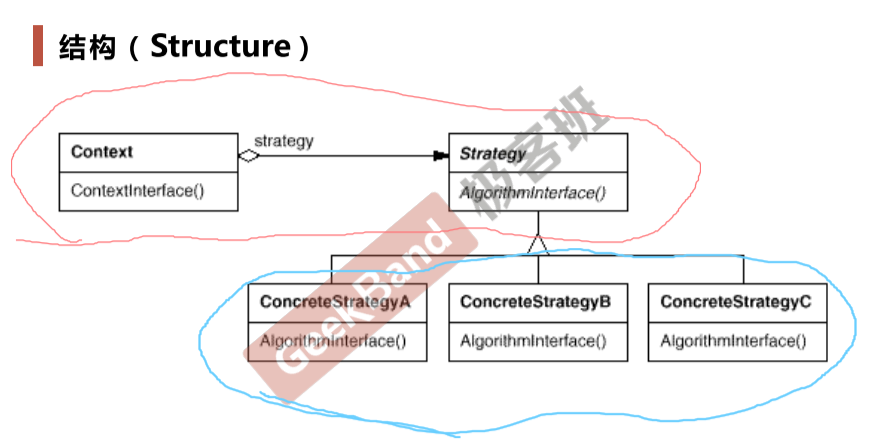

# Strategy

[4_策略模式.pdf](file/4_%E7%AD%96%E7%95%A5%E6%A8%A1%E5%BC%8F.pdf)

> 组件协作 模式

> 在软件构建中，某些对象使用的算法可能多样，经常改变，如果将算法都编码到对象中，将会使对象变得异常复杂，而且有时候支持不使用的算法也是一种性能负担

复用性 ： 二进制单位 编译单元的复用性，而不是源代码的复用性

> 定义一系列算法，把他们一个个封装起来，并且使他们可以可互相替换（变化）。该模块使得算法可独立于使用他的客户程序（稳定）而变化（扩展，子类化）

#### 要点总结

&ensp;&ensp;&ensp;&ensp;Strategy及其子类为组件提供一系列可重用的算法，从而可以使得类型在运行时方便地根据需要在各个算法之间进行切换

&ensp;&ensp;&ensp;&ensp;Strategy模式提供了用条件判断语句以外地另一种中选择，就是在解耦合。含有许多条件判断语句地代码通常都需要Strategy模式

&ensp;&ensp;&ensp;&ensp;如果Strategy对象没有实例变量，那么各个上下文可以共享同一个Strategy对象，从而节省对象开销

