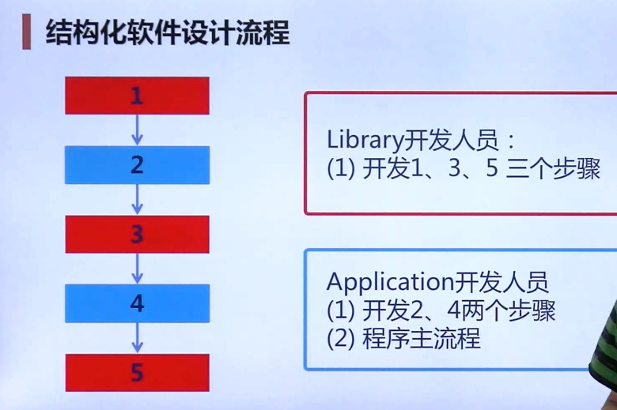
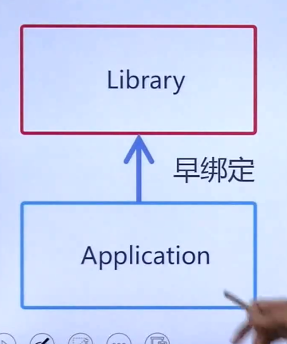
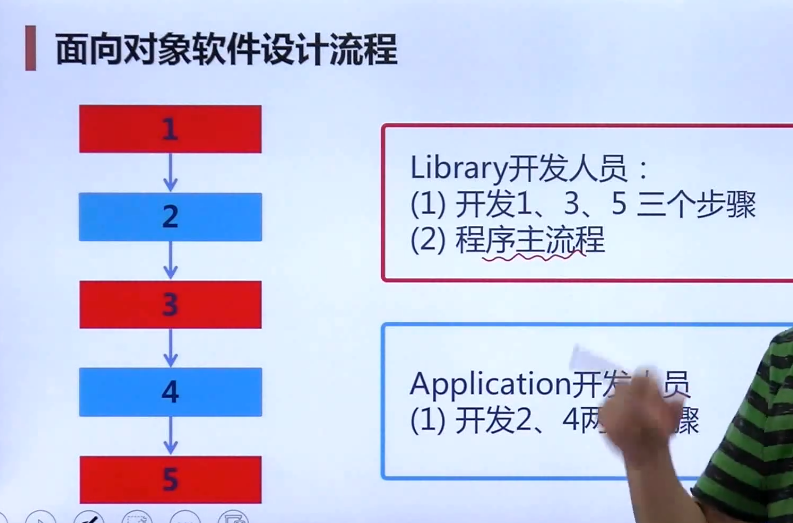
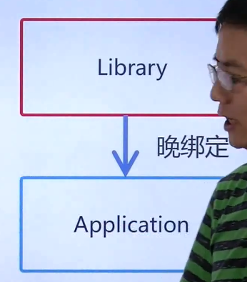
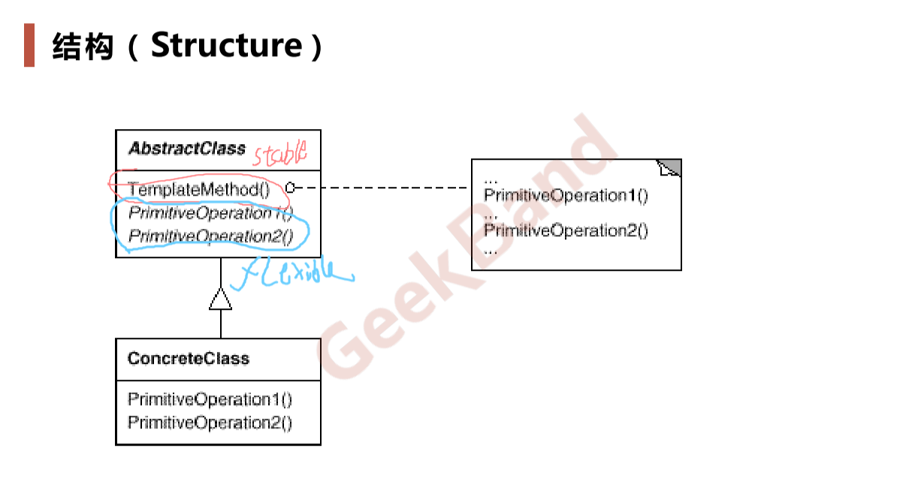

# Template Method

[3_Template Method_模板方法.pdf](file/3_Template%20Method_%E6%A8%A1%E6%9D%BF%E6%96%B9%E6%B3%95.pdf)

> 在软件构建中，常常有稳定的整体操作结构，但各个子步骤却又很多改变的需求，或者由于固有的原因而无法和任务的整体结构同时实现。

结构化软件设计

面向对象软件设计

#### 定义：

&ensp;&ensp;&ensp;&ensp;> 定义一个操作的算法骨架（稳定），而将一些步骤延迟到子类中，Template Method使得子类不改变（复用）一个算法的结构即可重定义（override重写）该算法的某些特定步骤

> 基础性的设计模式

> 不要调用我，而是我来调用你

> 具体实现，template method 调用的虚方法可以实现，也可以没有实现（抽象方法，纯虚方法）

