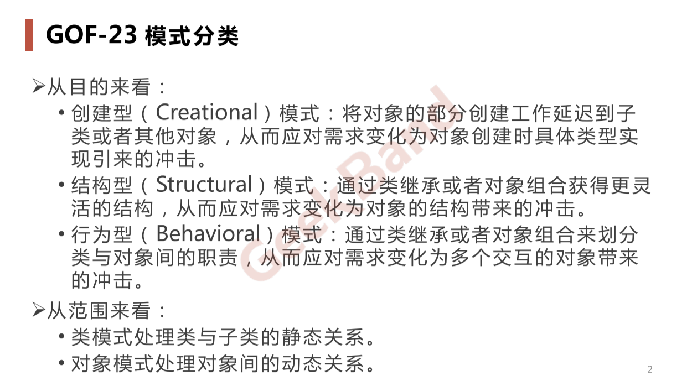
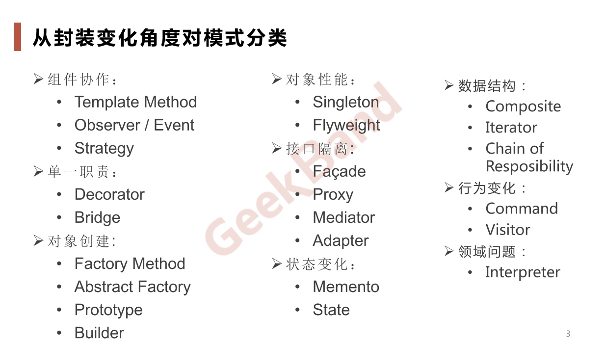
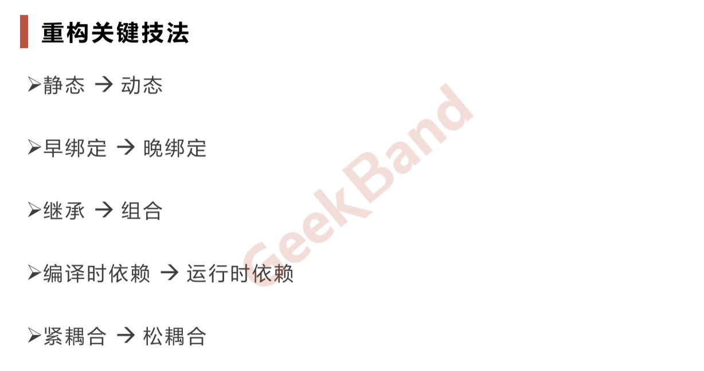

# 简介

《设计模式 GOF》

#### 底层思维

向下，如何把握机器底层，从微观理解对象构造

语言构造

编译转换

内存模型

运行时机制

抽象思维

向上，如何将我们的世界抽象成程序代码

面向对象

组件封装

设计模式

架构模式

#### 分解

&ensp;&ensp;&ensp;&ensp;分而治之，将大问题分解为小问题，将复杂问题分解为多个简单问题

#### 抽象

&ensp;&ensp;&ensp;&ensp;忽略他的非本质细化信息，处理泛化和理想化了的对象模型

## 分类

