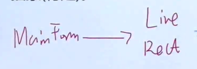
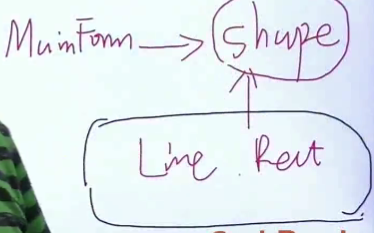

# 面向对象的设计原则

#### 依赖倒置原则

&ensp;&ensp;&ensp;&ensp;高层模块（稳定）不应该依赖于底层模块（变化），二者都依赖于抽象（稳定）

&ensp;&ensp;&ensp;&ensp;抽象（稳定）不应该依赖于实现细节（变化），实现细节应该依赖于抽象（稳定）

&ensp;&ensp;&ensp;&ensp;> 理解：对变化的隔离，shape是父类，稳定的，Line，Rect等具体的类是变化的

第1列

第2列

#### 开放封闭原则

&ensp;&ensp;&ensp;&ensp;对扩展开放，对更改封闭

&ensp;&ensp;&ensp;&ensp;类模块应该是可以扩展的，但是不可修改

#### 单一职责原则

&ensp;&ensp;&ensp;&ensp;一个类应该仅有一个引起他变化的原因

&ensp;&ensp;&ensp;&ensp;变化的方向隐含类的责任

#### Liskov 李氏替换原则

&ensp;&ensp;&ensp;&ensp;子类必须可以替换他们的基类（IS - A）

&ensp;&ensp;&ensp;&ensp;继承表达类型抽象

&ensp;&ensp;&ensp;&ensp;> 理解：父类必须体现共性

#### 接口隔离原则

&ensp;&ensp;&ensp;&ensp;不应该强迫客户程序依赖他们不用的方法

&ensp;&ensp;&ensp;&ensp;接口应该小而完备

#### 优先使用对象组合而不是类继承

&ensp;&ensp;&ensp;&ensp;继承通常为白箱复用，对象组合通常为黑箱复用

&ensp;&ensp;&ensp;&ensp;继承在某种程度上破环了封装性，子类父类耦合度高

&ensp;&ensp;&ensp;&ensp;而对象组合只要求被组合的对象具有良好定义的接口，耦合程度低

#### 封装变化点

&ensp;&ensp;&ensp;&ensp;使用封装来创建对象之间的分界层，让设计者可以在一侧进行更改，而不会对另一侧产生不良的影响，从而实现松耦合

#### 针对接口编程，而不是针对实现编程 ？

&ensp;&ensp;&ensp;&ensp;不将变量类型声明为某个特定的具体类，而是声明为某个接口

&ensp;&ensp;&ensp;&ensp;客户程序无需获知对象的具体类型，只需要知道对象所具有的接口

&ensp;&ensp;&ensp;&ensp;减少系统中个部分的依赖关系，从而实现高内聚 松耦合的类型设计方案

#### 

